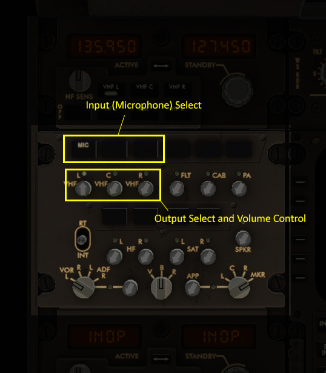

Getting Started
***************

Before you Begin
================

Before you download and install XSquawkBox 2, you should prepare your X-Plane
installation and ensure your system meets the requirements.

Also, if you haven't already done so, you should read through the VATSIM
terms & conditions, and register yourself an account.

System Requirements
-------------------

As of XSquawkBox 2.0, XSquawkBox requires X-Plane 10.51+ or 11.36+ and one
of:

 - An X-Plane supported Mac running macOS 10.12 or newer.
   (If you're using macOS 10.14 or 10.15, please see the compatibility note below).
 
 - A PC running an X-Plane supported version of 64-bit Windows with suitable 
   graphics hardware

 - A PC running an X-Plane supported version of 64-bit Linux with suitable
   graphics hardware

If in doubt, about X-Plane support, please check the official 
`X-Plane 10 System Requirements`_ or `X-Plane 11 System Requirements`_ as
appropriate.

.. _X-Plane 10 System Requirements: http://www.x-plane.com/?article=x-plane-10-system-requirements
.. _X-Plane 11 System Requirements: http://www.x-plane.com/kb/x-plane-11-system-requirements/

If your X-Plane is a supported version, but not a supported release, please
follow the official instructions for `updating X-Plane 10`_ or 
`updating X-Plane 11`_ prior to installing XSquawkBox.

.. _updating X-Plane 10: https://www.x-plane.com/kb/updating-x-plane/
.. _updating X-Plane 11: https://www.x-plane.com/kb/updating-x-plane-11/

A note about macOS 10.14 and newer
^^^^^^^^^^^^^^^^^^^^^^^^^^^^^^^^^^

Our ability to support macOS 10.14 is highly limited due to the introduction of
the Audio permissions system.  If the issue cannot be reproduced on 10.15, we
cannot support it at this time.

Further, As macOS 10.15 isn't compatible with 32-bit applcations, and 
X-Plane 10's support tools are 32-bit only, we cannot recommend you try to run
XSquawkBox on macOS 10.15 with X-Plane 10 either.

For this reason, X-Plane 10 is not supported on macOS 10.14 or 10.15 - we have
made no efforts to prevent it from working, but we will not act on bug reports
for X-Plane 10 related issues on these versions of macOS.

On macOS 10.15 (or newer), X-Plane 11.41 (or newer) is **required** for 
microphone support to work at all.

.. NOTE::

   Due to changes in the GateKeeper proection system, macOS 10.15 may refuse to 
   load the XSquawkBox plugin unless you either:

   * Explicitly authorise the plugin to load after it has failed once

   * Disable Gatekeeper completely
   
Also note Laminar's position on macOS Catalina:

    "If your X-Plane 11 setup is heavily enhanced with add-ons, you may want
    to remain with Mojave."

    -- From the X-Plane Knowledge-base Article, `macOS Catalina & X-Plane`_ - 2019 Nov 18

.. _macOS Catalina & X-Plane: https://www.x-plane.com/kb/macos-catalina-x-plane/

X-Plane Performance Requirements
--------------------------------
In addition to the basic requirements, you must configure your X-Plane to run in
real-time, that is, to have a framerate safely exceeding 20 frames per second in
all phases of operation.  The 20 frames per second minimum `comes from X-Plane 
itself <https://www.x-plane.com/kb/the-simulators-measurement-of-time-is-slow/>`_
and is a consequence of it's design.

Laminar Software maintains documentation on how to set the rendering options
correctly for 
`X-Plane 10 <https://www.x-plane.com/kb/setting-the-rendering-options-for-best-performance/>`_
and for
`X-Plane 11 <https://www.x-plane.com/manuals/desktop/#settingtherenderingoptionsforbestperformance>`_.

.. WARNING::

   If you do not configure X-Plane to achieve a minimum of 20 frames per second
   reliably in flight and on the ground, you may be disconnected automatically
   to prevent you from inconveniencing other pilots and controllers.

   That is, your frame rate should not regularly dip below 20fps for more than
   one or two frames, and should not sit, even marginally, below 20fps for
   any sustained period of time.

.. TIP::

   In the developer's experience, the phases of flight that cause the most 
   problems with frame-rates are those on the ground and on approach at low
   altitude, where the scenery rendering demands are at their highest.

   You should not optimise your simulator for framerate in the cruise at the
   expense of performance during those phases.

Plugin Compatibility
--------------------

As the underlying `libxplanemp <https://github.com/kuroneko/libxplanemp>`_
traffic rendering code was never intended to be loaded and operated concurrently
by multiple plugins at once,  XSquawkBox will conflict with any plugin that
uses it, or similar methods, to control traffic depiction inside the simulator.

The usual outcome of these conflicts is that one or more plugins will not be
able to inject TCAS information, or XSquawkBox will not be able to use its
ACF traffic rendering options.

If you wish to use these plugins, you should move XSquawkBox's folder out of 
your plugin folder when you're not using it, and similarly, you should move
conflicting plugins out of your plugin folder when you intend to use XSquawkBox.
If you do not do this, the developers cannot provide support for any issues
that may arise.

.. WARNING::

   It is NOT sufficient to use the X-Plane plugin manager to disable conflicting
   plugins as that happens well after simulator load.  They must not be
   installed together in order to prevent conflicts **during** simulator load.

Plugins that are known or assumed to cause related conflicts are:

* X-Ivap

* XSwiftBus (the Swift X-Plane interface)

* The PilotEdge client

* X-Pilot

* LiveTraffic

.. admonition:: Further Information

   XSquawkBox does not and will not support the concurrent injection of traffic
   from multiple sources.

   Such behaviour, if permitted, would create severe difficulties for
   controllers in sequencing and separating you as they would have to account
   for "phantom" aircraft they cannot see.
   
   Do not contact the developers about this.

Installing XSquawkBox
=====================

Installing the Plugin
---------------------

XSquawkBox is distributed as a Zip-file that contains the XSquawkBox plugin for
all three platforms (Windows, macOS and Linux), and a minimum set of resources
to use XSquawkBox.

To install the plugin:

1. Ensure that X-Plane is not running.

2. Locate your X-Plane installation folder, then open the subfolder "Resources",
   then "Plugins".

3. Open or unzip the distribution zipfile, and then move the "XSquawkBox" folder
   from the XSquawkBox distribution into the Plugins folder.

Once this has been done, when you start up X-Plane and start a flight, you 
should see a "XSquawkBox" menu item in the plugins menu.

If the menu item is missing, please see the section on
:ref:`troubleshooting plugin loading issues <troubleshooting-load>`

Configuring your Operating System
---------------------------------

To ensure that XSquawkBox can acquire your microphone at the correct sampling
rate, on Windows and macOS, it can be necessary to change the OS default
capture settings.  Please refer to the section in troubleshooting on 
:ref:`input visibility issues <troubleshooting-audio-devices>`.

Configuring XSquawkBox
======================

.. TIP::

   XSquawkBox 2 is significantly different to previous versions in this regard.

   Even if you have previous experience with XSquawkBox, it is highly 
   recommended you work through this section to ensure your key and button
   bindings are all set appropriately.

Configuring the keyboard commands
---------------------------------

Unlike previous releases of XSquawkBox, XSquawkBox 2.0 uses the X-Plane keyboard
and joystick binding system for its commands.

If you are not familiar with how to set up keyboard bindings in X-Plane, you can
refer to the manual for 
`X-Plane 10 <https://www.x-plane.com/manuals/desktop/10/index.html#configuringkeyboardshortcuts>`_ and
`X-Plane 11 <https://www.x-plane.com/manuals/desktop/index.html#configuringkeyboardshortcuts>`_ .

The commands available are detailed below:

+-------------------------------------------+------------------------------------+------------------------------------------------+
| Command Name                              | Display Name (X-Plane 11)          | Purpose                                        |
+===========================================+====================================+================================================+
| ``xsquawkbox/voice/ptt``                  | XSB: Radio Press-to-Talk           | Use to send on the selected radio              |
+-------------------------------------------+------------------------------------+------------------------------------------------+
| ``xsquawkbox/command/start_text_entry``   | XSB: Start Text Entry              | Use to activate the input prompt for text      |
|                                           |                                    | commands and text radio                        |
+-------------------------------------------+------------------------------------+------------------------------------------------+
| ``xsquawkbox/command/toggle_text_window`` | XSB: Toggle Text Window Visibility | Toggles visibility of the text radio/command   |
|                                           |                                    | window                                         |
+-------------------------------------------+------------------------------------+------------------------------------------------+
| ``xsquawkbox/text/prevpage``              | XSB: Text Window: Previous Page    | Scrolls the text window back one line          |
+-------------------------------------------+------------------------------------+------------------------------------------------+
| ``xsquawkbox/text/nextpage``              | XSB: Text Window: Next Page        | Scrolls the text window forward one line       |
+-------------------------------------------+------------------------------------+------------------------------------------------+
| ``xsquawkbox/text/start``                 | XSB: Text Window: Scroll to Start  | Scrolls the text window to the earliest line   |
+-------------------------------------------+------------------------------------+------------------------------------------------+
| ``xsquawkbox/text/end``                   | XSB: Text Window: Scroll to End    | Scrolls the text window to the latest line     |
+-------------------------------------------+------------------------------------+------------------------------------------------+
| ``xsquawkbox/command/reply_next``         | XSB: Reply to Last Sender          | Starts a reply to the person who last sent you |
|                                           |                                    | a ``.msg`` - subsequent presses cycle through  |
|                                           |                                    | recent senders                                 |
+-------------------------------------------+------------------------------------+------------------------------------------------+
| ``xsquawkbox/command/toggle_whos_online`` | XSB: Toggle Who's Online           | Toggles visibility of the Who's Online window  |
+-------------------------------------------+------------------------------------+------------------------------------------------+

.. NOTE::

   You must bind the Press to talk and Start Text Entry commands to use
   XSquawkBox - you will not be able to interact with the network properly
   without them

.. TIP:: 

   It is highly recommended you bind the `Toggle Text Visibility` and the text 
   window scroll commands.

Recommending Bindings for First-time Users
^^^^^^^^^^^^^^^^^^^^^^^^^^^^^^^^^^^^^^^^^^

* Bind ``xsquawkbox/command/start_text_entry`` (“XSB: Start Text Entry” in X-Plane
  11) to Enter and/or Space.

* Bind ``xsquawkbox/voice/ptt`` (“XSB: Radio Press-to-Talk” in X-Plane 11) to a
  joystick/yoke button that is easily accessible - usually a trigger or thumb
  button if you want an authentic position.

* Bind ``xsquawkbox/command/toggle_text_window`` ("XSB: Toggle Text Window 
  Visibility" in X-Plane 11) to Keypad - (minus).

* Bind ``xsquawkbox/text/prevpage`` ("XSB: Text Window: Previous Page" in 
  X-Plane 11) to Page Up.

* Bind ``xsquawkbox/text/nextpage`` ("XSB: Text Window: Next Page" in 
  X-Plane 11) to Page Down.

* Bind ``xsquawkbox/text/start`` ("XSB: Text Window: Scroll to Start" in X-Plane
  11) to Home.

* Bind ``xsquawkbox/text/end`` ("XSB: Text Window: Scroll to End" in X-Plane 11)
  to End.

* Bind ``xsquawkbox/command/reply_next`` ("XSB: Reply to Last Sender" in X-Plane
  11) to Keypad *

* Bind ``xsquawkbox/command/toggle_whos_online`` ("XSB: Toggle Who's Online" in
  X-Plane 11) to Keypad /

Using XSquawkBox
================

Using the Radio
---------------

Unlike XSquawkbox 1, which could only send and receive text on COM1, and could 
only transmit voice on COM1, XSquawkBox 2 makes full use of audio panel controls
and fully supports sending and receiving on both radios, both in text and using
voice.

Transmissions (both voice and text) will be sent to the selected 
transmission radio.

Voice will only be heard for radios with Receive enabled and the volume turned
up.

To accomodate this, you need to be familiar with the audio panel controls in 
your chosen aircraft model, in particular, the controls for audio volume, 
transmission source, and receive channel enable.

.. NOTE::

   Not all aircraft models expose all controls properly.  Please see the note
   at the end of this section on how to control XSB if the controls aren't
   available.

General Aviation Aircraft
^^^^^^^^^^^^^^^^^^^^^^^^^

Audio controls will typically be found center of the instrument panel and will
be divided into a dedicated audio control panel which selects the receive 
channels and transmission channel, and the radios or GPS units, which should
have the volume control for that source.

.. figure:: images/ConventionalGA-AudioPanel.jpg
  
  X-Plane 11 audio controls in the Cessna 172 (Center of Main Instrument Panel)

Airliners
^^^^^^^^^

Audio controls (for the captain / left-seat) will typically be on the pedestal
immediately, or to the forward left of the captain's seat.  This is typically
mirrored for the right set.

.. NOTE::

   XSquawkBox only supports control through the standard datarefs which allow
   for a single position and audio system only.  If your aircraft model connects
   the copilot controls to it's own set of datarefs, you will not be able to 
   control XSB's audio with those controls.

The audio panel will typically control volume, output enable and transmission 
source selection all in one place.

  X-Plane 11 audio controls in the Boeing 747-400 (Center Pedestal)

Aircraft without a working audio panel
^^^^^^^^^^^^^^^^^^^^^^^^^^^^^^^^^^^^^^

If your aircraft model doesn’t have a working transmission selector, you can use
the ``.tx ?`` command to find out which radio is set to transmit, and use the 
``.tx COM1`` or ``.tx COM2`` commands to change the active radio to send.

Similarly, if your aircraft model’s audio panel doesn’t have proper receive 
select controls you can use ``.rx COM1 on`` and ``.rx COM1 off`` (and similarly
for COM2) to turn that audio source on and off.

