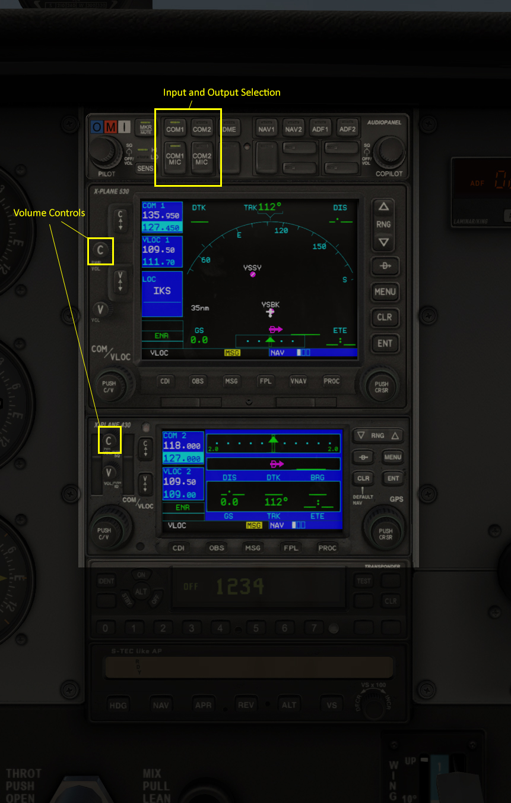
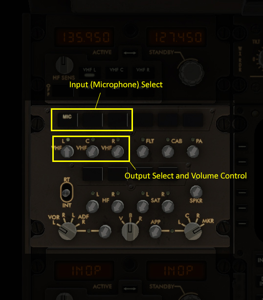

Using XSquawkBox
****************

Connecting to the Network
=========================
To connect to the network, access the "Plugins" menu at the top of the screen,
select "XSquawkBox" and then pick "Connect...".  A dialog box will come up 
asking for the following fields:

Callsign
    The callsign you will be known as on the network for this session. It
    must include only letters, numbers, hypens or underscores.  
    
    Examples: ``N1943``, ``DAL2024``, ``VH-RDO``

Real Name
    Your full name (or otherwise as permitted by VATSIM Policy).
    
    Examples: John Q. Smith

Server    
    The VATSIM Server name (e.g: ``AUSTRALIA``, ``USA-W``, etc), IP address
    or fully-qualified domain name of your server.

    You generally want to pick a server from the dropdown list that is closest 
    to you geographically.

    .. NOTE::

       Do not attempt to connect to ``AFVDATA`` - it's not a real server.

       If you want to connect to ``localhost`` or other single element domain
       name, you **MUST** use the IP address instead - single-element names
       are interpreted as server list entries.

Port
    The port for the server you will connect to.  This should be set to ``6809``
    when on the VATSIM network.

ID
    Your pilot's ID, also known as your Certificate ID.  It's a number you 
    receive when you sign up to VATSIM.
    
    Example: ``1810123``

Password
    The password for your VATSIM account - given to you when you sign up for 
    VATSIM.  This is case-sensitive so make sure you enter your password exactly
    as issued.  It will appear as stars so that other people cannot read it.

    .. CAUTION::

       The text/traffic server does not handle your password in a case-sensitive
       manner, but the voice servers do.  If you get the case in your password
       incorrect, you will be able to connect, but voice will fail.

Aircraft Model
    The ICAO equipment code of your aircraft.
    
    If you do not know the correct 4 letter equipment code, you can type a few
    letters from the name or ICAO code of this airplane, then click on the 
    correct item in the menu to set it; XSquawkBox will search its database of
    thousands of aircraft and show you named matches.  
    
    .. NOTE::
    
       It is important that you select an item from the popup, even if it's the
       only match, otherwise the change will not take effect!

Airline
    (optional) The 3 letter ICAO airline code that you want your aircraft to
    appear as to others.
    
    If you don’t know the correct code, you may pick an airline by typing part
    of its name, and clicking on the correct airline from the menu. Or you may
    leave this blank.

Livery
    (optional) For some aircraft, multiple paint schemes are defined.  This
    optional setting will let you nominate a specific sub-livery that your
    aircraft should appear as to others.

.. NOTE::

   The aircraft, airline and livery you pick in XSquawkBox are used to tell 
   other pilots on the network what your plane looks like. You do not have to 
   pick values that match your plane in X-Plane. For example, if you are flying
   a SWA 737 400 in X-Plane you could pick a UAL 737 800 when you connect.
   
   That said, you should not list yourself as a very different planes.  For
   example, should you fly an FA-18 but list yourself as aircraft model code
   ``C172``, then other users will see a Cessna 172 flying at 350 knots, which
   will look very strange.

Once you've filled in the necessary fields, click the connect button; you will 
see the prompt "Connecting..." at the top of your screen. If the login is
successful, you will then see the welcome message for the VATSIM network. If you
cannot login, you will receive an error message. If the server cannot be 
reached at all, you will simply see "You have been disconnected."

Disconnecting from the Network
==============================

To disconnect from the network, access the "Plugins" menu at the top of the
screen, select "XSquawkBox" and then pick "Disconnect". After a second or two,
the message "Disconnected" will appear on the screen.  

You may also be disconnected inadvertently due to internet problems, if a 
supervisor removes you from the network, or if XSquawkBox detects a problem with
your simulator configuration.

Operating the Transponder
=========================

A transponder is a radio transmitter and receiver on your airplane that helps 
air traffic controllers identify you on their radar screens. The transponder 
transmits a four-digit code (often called a "squawk code") that identifies 
your aircraft.

The X-Plane transponder on your airplane's panel controls your squawk code as
seen by air traffic control on the network. If you do not have a transponder on
your plane's panel, you will not be able to change your transponder settings 
and may not be allowed on the network.

.. TIP::

   You can add a transponder to your aircraft's panel using Plane-Maker.  You 
   should refer to the Plane-Maker documentation for further information.

Use the keyboard or mouse to change transponder codes as assigned by ATC. Do not
ever let the transponder read ``7500``, ``7600``, or ``7700``; as in real life
this will trigger alerts for ATC.

Use the transponder controls in your aircraft to toggle between standby and 
Mode C (Typically labelled ``ALT``, although in TCAS equipped aircraft with a 
combined mode knob, the ``TA`` and ``TA/RA`` settings will also work).

To put send an ident signal ("Squawk Ident"), click the 'ident' button on your
transponder on the x-plane panel with the mouse.  You should only do this as
explicitly directed by ATC.

Using the Radio
===============

.. CAUTION::

   Even if you are familiar with XSquawkBox 1.x - please make sure to read this
   section as some very important details have changed.

Unlike XSquawkbox 1, which could only send and receive text on COM1, and could 
only transmit voice on COM1, XSquawkBox 2 makes full use of audio panel controls
and fully supports sending and receiving on both radios, both in text and using
voice.

Transmissions (both voice and text) will be sent to the selected 
transmission radio.

XSquawkBox 2 supports 8.33Khz tuning other both voice and text, although the
VATSIM network currently does not.  You should only use 25Khz radio frequencies.

.. NOTE::

   There is a long standing error in VATSIM usage with many ATC and Pilot
   clients, and consequentially, users, reporting x.x25MHz and x.x75MHz 
   frequencies incorrectly as being x.x20MHz and x.x70MHz respectively.
   
   XSquawkBox now corrects all usage of .x20 and .x70 to their correct 
   frequencies.  This will cause some deviation from VATspy, or other tools, 
   but you will get the correct behaviour when you tune the corrected 
   frequency.

Using Text
----------

When you receive a text message on a tuned radio, it'll appear in the text 
window.  If the text window is hidden, it'll automatically unhide for a few 
seconds so you can read the message, before hiding again.

You can toggle visibilty of the text window using the key or button bound to
``xsquawkbox/command/toggle_text_window``.  (Recommended key "Keypad -")

To transmit on text, make sure you have the correct transmission radio selected
on your radio panel, and press the key bound to 
``xsquawkbox/command/start_text_entry`` (recommended key "Enter")

This will bring up the text radio view (if hidden) and enable keyboard input.

You can type your message (or command starting with ``.``) and press enter to 
send it.

If you wish to transmit to a specific callsign, you can use the command:
``.msg <callsign> <message...>``

If you want to respond to a private or direct message, you can use the key bound
to ``xsquawkbox/command/reply_next`` (recommended key "Keypad *") to cycle 
through people who have recently sent to you.

For details about other commands that can be entered through the text input, 
please see the section about commands below.

Using Voice
-----------

XSquawkBox simulates a 2 radio stack with a monaural mixer.  It responds to
the X-Plane 10/11 controls for radio volume, audio transmission select and 
receive enable and these must be set approriately for the radios to work as 
desired.  See the section on Audio Panel Controls for some examples as to how
these are configured.

As real world radios are half-duplex, the XSquawkBox voice radios similarly are
so - if you are transmitting, you will not hear any radio coming in on that
unit.  You will still hear audio received by your secondary radio (if enabled).

To transmit, make sure the transmission selector on your audio panel is set
to the radio you want to talk on, and press the button or key bound to
``xsquawkbox/voice/ptt``, and speak clearly into your microphone only releasing
the button or key after you have finished speaking.

Audio Panel Controls
--------------------

In order to make use of your radios, you need to be familiar with the audio 
panel controls in your chosen aircraft model, in particular, the controls for 
audio volume, transmission source, and receive channel enable.

.. NOTE::

   Not all aircraft models expose all controls properly.  Please see the note
   at the end of this section on how to control XSB if the controls aren't
   available.

General Aviation Aircraft
^^^^^^^^^^^^^^^^^^^^^^^^^

Audio controls will typically be found center of the instrument panel and will
be divided into a dedicated audio control panel which selects the receive 
channels and transmission channel, and the radios or GPS units, which should
have the volume control for that source.

  
  X-Plane 11 audio controls in the Cessna 172 (Center of Main Instrument Panel)

Airliners
^^^^^^^^^

Audio controls (for the captain / left-seat) will typically be on the pedestal
immediately, or to the forward left of the captain's seat.  This is typically
mirrored for the right set.

.. NOTE::

   XSquawkBox only supports control through the standard datarefs which allow
   for a single position and audio system only.  If your aircraft model connects
   the copilot controls to it's own set of datarefs, you will not be able to 
   control XSB's audio with those controls.

The audio panel will typically control volume, output enable and transmission 
source selection all in one place.

  X-Plane 11 audio controls in the Boeing 747-400 (Center Pedestal)

In the 747-400 example above, individual radio receivers are enabled by clicking
on the center of the volume stem, causing an indicator above them to illuminate.

Aircraft without a working audio panel
^^^^^^^^^^^^^^^^^^^^^^^^^^^^^^^^^^^^^^

If your aircraft model doesn’t have a working transmission selector, you can use
the ``.tx ?`` command to find out which radio is set to transmit, and use the 
``.tx COM1`` or ``.tx COM2`` commands to change the active radio to send.

Similarly, if your aircraft model’s audio panel doesn’t have proper receive 
select controls you can use ``.rx COM1 on`` and ``.rx COM1 off`` (and similarly
for COM2) to turn that audio source on and off.

Filing a Flight Plan
--------------------

You can file a flight plan from XSquawkBox. 

Access the "Plugins" menu at the top of the screen, select "XSquawkBox" and then
pick the "Send Flightplan..." menu item.

A flight plan dialog box will appear. From this dialog box you can enter your 
flight plan and then press Send to send it to the network.

If ATC has edited your flight plan, sending a new one may have no effect. If you
resend a flight plan and the controller does not receive it, notify the
controller that he or she must refile the flight plan for you.

.. TIP::

   Even if you have already filed a flight plan online via the VATSIM web page,
   or even if you are flying VFR and do not intend to request ATC services,
   you may still want to fill out the flight plan dialog box with a departure
   and destination airport as XSquawkBox will use this information to correctly
   set up weather from your departure and destination airports, rather than
   airports you overfly nearby your departure and destination.
